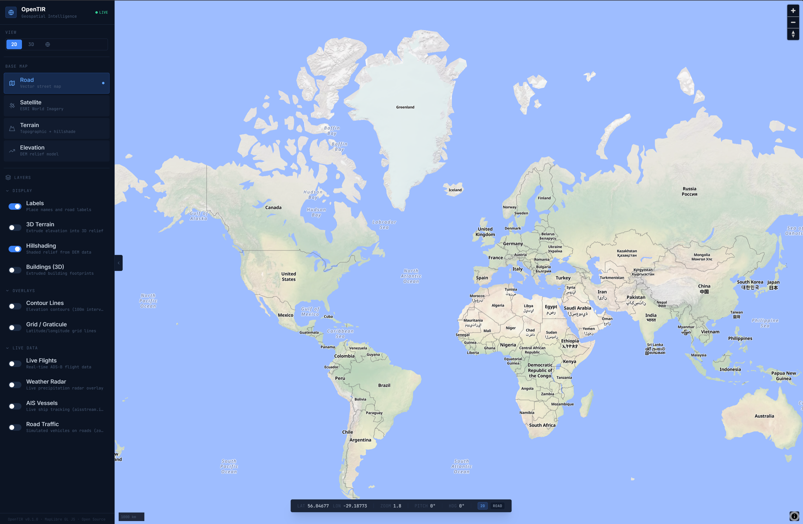
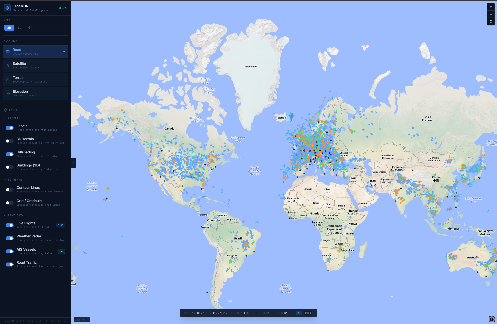

# OpenTIR — Geospatial Intelligence Platform

A real-time geospatial intelligence platform for monitoring live flight traffic, maritime vessels, weather radar, and more — all on a single interactive map.



---

## Features

### Live Data Layers
- **Live Flights** — Real-time ADS-B aircraft positions via OpenSky Network, including altitude, speed, heading, vertical rate, squawk, and callsign
- **AIS Vessels** — Real-time ship tracking via AISStream WebSocket, showing vessel name, type, speed, course, and navigation status
- **Weather Radar** — Live precipitation radar overlay powered by RainViewer
- **Road Traffic** — Simulated vehicle layer on roads (available at zoom level 13+)

### Map Styles
| Style | Description |
|-------|-------------|
| **Road** | Vector street map via OpenFreeMap (Liberty) |
| **Satellite** | ESRI World Imagery aerial photography |
| **Terrain** | Topographic map with hillshading |
| **Elevation** | DEM-based relief visualization |

### Visualization Modes
- **2D** — Standard flat orthogonal view
- **3D** — Pitched perspective view (45°) with automatic terrain extrusion
- **Globe** — Spherical globe projection

### Display Controls
- Toggle place name **labels**
- **3D Terrain** extrusion with adjustable exaggeration (0.5×–5.0×)
- **Hillshading** from DEM data
- Extruded **3D Buildings**
- **Contour Lines** (100m intervals)
- **Grid / Graticule** (lat/lon lines at 10° intervals)

---

## Screenshots

### Live Flights & Vessels — Road View
Global real-time aircraft and ship positions on the vector street map.



### Live Flights & Vessels — Satellite View
The same live data overlaid on ESRI World Imagery.


### Flights & Vessels along the Coast
Aircraft and maritime traffic visible along a coastline in satellite view.


### Road Traffic — 3D Satellite View
Simulated road vehicles rendered in a pitched 3D perspective over satellite imagery.


### 3D Buildings — Satellite View
Extruded building footprints with live tracking markers at street level.


---

## Tech Stack

| Layer | Technology |
|-------|-----------|
| Framework | React 18 + TypeScript |
| Build Tool | Vite |
| Map Engine | MapLibre GL JS |
| State Management | Zustand |
| Styling | Tailwind CSS |
| Icons | Lucide React |

---

## Data Sources

| Source | Data | Docs |
|--------|------|------|
| [OpenSky Network](https://opensky-network.org/) | Live ADS-B flight states | OAuth2 REST API |
| [AISStream](https://aisstream.io/) | Real-time AIS vessel positions | WebSocket API |
| [RainViewer](https://www.rainviewer.com/api.html) | Precipitation radar tiles | REST API |
| [OpenFreeMap](https://openfreemap.org/) | Vector base map tiles | — |
| [ESRI ArcGIS](https://www.arcgis.com/) | Satellite & terrain tiles | — |
| [AWS Terrain Tiles](https://registry.opendata.aws/terrain-tiles/) | DEM elevation (Terrarium) | — |

---

## Getting Started

### Prerequisites
- Node.js 18+
- API keys for OpenSky Network and AISStream (free tiers available)

### Installation

```bash
git clone https://github.com/hendrikbgr/open-live-map.git
cd open-live-map
npm install
```

### Configuration

Copy the example environment file and fill in your credentials:

```bash
cp .env.example .env.local
```

```env
# OpenSky Network API credentials
# Register at https://opensky-network.org/
VITE_OPENSKY_CLIENT_ID=your_opensky_client_id
VITE_OPENSKY_CLIENT_SECRET=your_opensky_client_secret

# AISStream API key
# Register at https://aisstream.io/
VITE_AISSTREAM_API_KEY=your_aisstream_api_key
```

> **Note:** The app works without credentials — OpenSky falls back to unauthenticated access (rate-limited) and vessels/weather still load. You'll get the best experience with credentials configured.

### Running Locally

```bash
npm run dev
```

Open [http://localhost:5173](http://localhost:5173) in your browser.

### Building for Production

```bash
npm run build
npm run preview
```

---

## Project Structure

```
src/
├── components/
│   ├── Map/
│   │   └── MapView.tsx         # MapLibre GL map container
│   └── UI/
│       ├── Sidebar.tsx         # Collapsible control panel
│       ├── LayerPanel.tsx      # Layer toggle controls
│       ├── StyleSelector.tsx   # Base map switcher
│       ├── ViewModeToggle.tsx  # 2D / 3D / Globe toggle
│       ├── TerrainControls.tsx # Elevation exaggeration slider
│       ├── FlightPanel.tsx     # Aircraft detail panel
│       ├── VesselPanel.tsx     # Vessel detail panel
│       └── StatusBar.tsx       # Coordinate / zoom / pitch HUD
├── services/
│   ├── opensky.ts              # OpenSky Network REST client
│   ├── aisstream.ts            # AISStream WebSocket client
│   └── rainviewer.ts           # RainViewer radar tile fetcher
├── store/
│   ├── mapStore.ts             # Map state (style, view mode, layers)
│   ├── flightStore.ts          # Flight data and selected aircraft
│   └── vesselStore.ts          # Vessel data and selected vessel
├── config/
│   └── mapStyles.ts            # Map style definitions
└── types/
    ├── flight.ts               # Flight data types
    ├── vessel.ts               # Vessel data types
    └── map.ts                  # Map state types
```

---

## License

MIT — see [LICENSE](LICENSE) for details.

---

*OpenTIR v0.1.0 · Built with MapLibre GL JS · Open Source*
